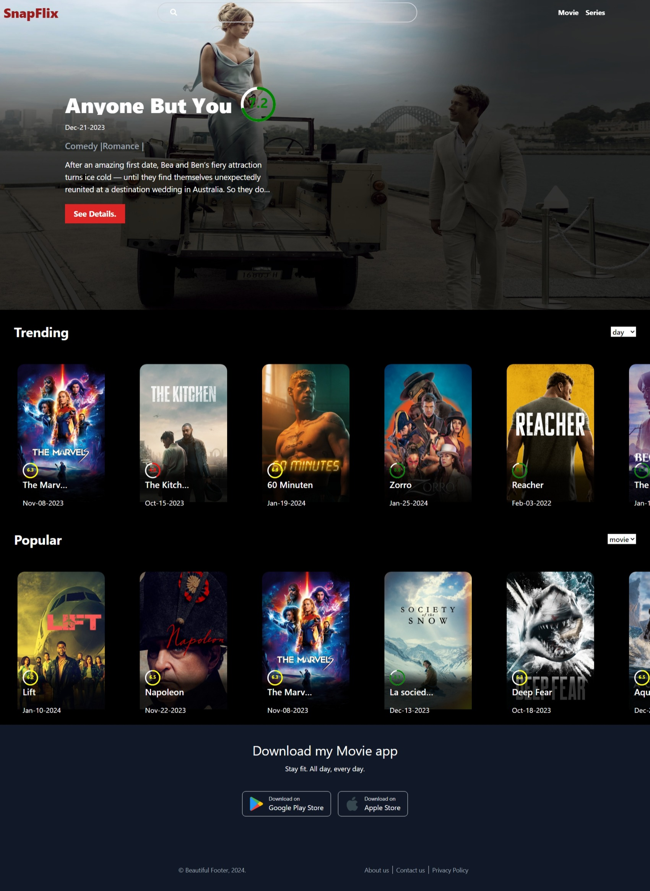

<h1 align="center">
   
  
   
 SnapFlix
   
</h1>

<h4 align="center">A minimal Movie info Website mase With <a href="https://www.themoviedb.org/" target="_blank">TMDB</a>.</h4>

## Key Features

* Upcoming Movies on Hero Banner.
* Dynamic Skeleton Loader 
* Movie Detail Section
* Videos Relevant to That Movie
* Actor Details
* Infinite Scrolling
* Supports Multiple Cursors
* Similar & Recommended Movies Section
